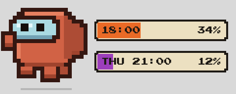
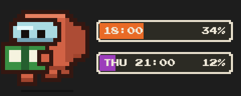
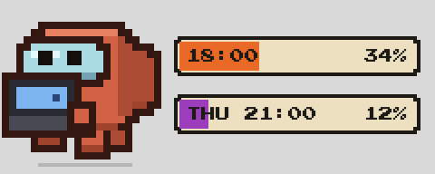
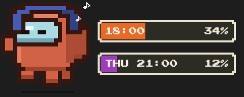
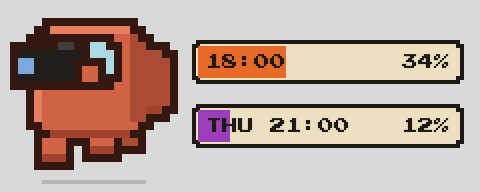
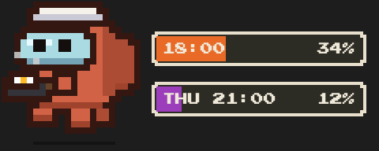
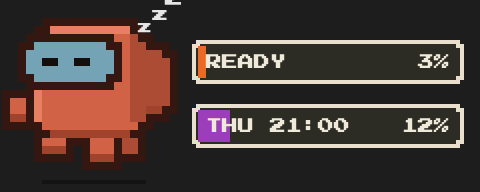
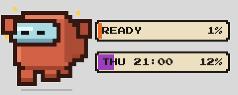
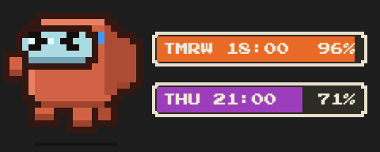

# Claude Usage Widget 🦀

A tiny **Codex-pets-style floating desktop widget** for macOS that shows your real
Claude subscription usage — the 5-hour session limit and the weekly limit — with
**Claw'd**, Claude Code's crab mascot, as an animated pixel-art companion
(Among Us-style crewmate look, 90's Pokemon UI).



## What it does

- **Always-on-top native widget** (Swift/Cocoa `NSPanel`) — floats over every app
  and Space, no Dock icon, never steals focus. Drag to move; position is remembered.
- **Real account data** — the same endpoint Claude Code's `/usage` uses, refreshed
  every 60 s. Each bar shows the reset day/time and the percent used:
  orange = 5-hour session, purple = weekly.
- **Claw'd reacts to your usage**
  - cycles hobbies while things are calm: reading, coding, music, photography, cooking

        
  - **sleeps at night** (22:00–07:00) 
  - **dances when a limit resets** 
  - gets worried at ≥70 % and panics (>< eyes, sweat, trembling) at ≥90 %

    
- Auto-starts at login (registered via `SMAppService`; visible in
  System Settings › Login Items).

## Install

Requirements: **macOS 13+**, **Xcode Command Line Tools** (`xcode-select --install`),
and a machine where you are **logged in to [Claude Code](https://claude.com/claude-code)**
with a Claude subscription.

```bash
git clone https://github.com/hengkp/claude-usage-widget.git
cd claude-usage-widget
./install.sh
```

Uninstall with `./uninstall.sh`.

## How it works / security

```
widget app (Swift)  ──HTTP──▶  server.py (127.0.0.1:8737)
                                 │  reads OAuth token from the macOS Keychain
                                 │  (the same "Claude Code-credentials" entry
                                 │   Claude Code itself uses)
                                 ▼
                     api.anthropic.com/api/oauth/usage
```

- The local server binds to **127.0.0.1 only**. Tokens never leave your machine,
  are never written to disk in plain text, and are never sent to the widget UI.
- When the access token expires the server refreshes it against
  `platform.claude.com/v1/oauth/token` and **writes the rotated token back to the
  Keychain**, exactly like Claude Code does, so your CLI login keeps working.
- If a fetch fails transiently the widget keeps showing the last known values
  (it only says OFFLINE after ~3 minutes of consecutive failures).
- `READY` in a bar means that window just reset and has no active session yet.

## Development

```bash
# rebuild after editing the Swift sources
swiftc -O -o "/Applications/Claude Usage.app/Contents/MacOS/ClaudeUsage" \
    app/WidgetView.swift app/main.swift
codesign --force -s - "/Applications/Claude Usage.app"

# the legacy HTML versions (Apple-Watch rings / Ghibli meadow) still live at
# http://127.0.0.1:8737 while server.py is running
```

## สำหรับผู้ใช้ภาษาไทย

Widget ลอยบนจอแสดง limit การใช้งาน Claude ของบัญชีคุณแบบเรียลไทม์ — แถบส้ม =
รอบ 5 ชั่วโมง, แถบม่วง = รายสัปดาห์ พร้อมน้อง Claw'd ที่เปลี่ยนท่าทางตามสถานการณ์:
ทำกิจกรรมเพลินๆ ตอนโควต้าเหลือเยอะ, หน้ากังวลเมื่อใช้เกิน 70%, ตกใจเหงื่อแตกเมื่อเกิน
90%, นอนหลับตอนกลางคืน และเต้นฉลองตอนโควต้ารีเซ็ต ติดตั้งด้วย `./install.sh`
(ต้องมี Xcode Command Line Tools และ login Claude Code ไว้แล้ว)

## Credits & license

- Code: [MIT](LICENSE)
- Font: [Press Start 2P](https://fonts.google.com/specimen/Press+Start+2P)
  by CodeMan38, [SIL OFL 1.1](app/fonts/OFL.txt)
- **Claw'd** is Anthropic's Claude Code mascot. This is an unofficial fan-made
  tool, not affiliated with or endorsed by Anthropic.
